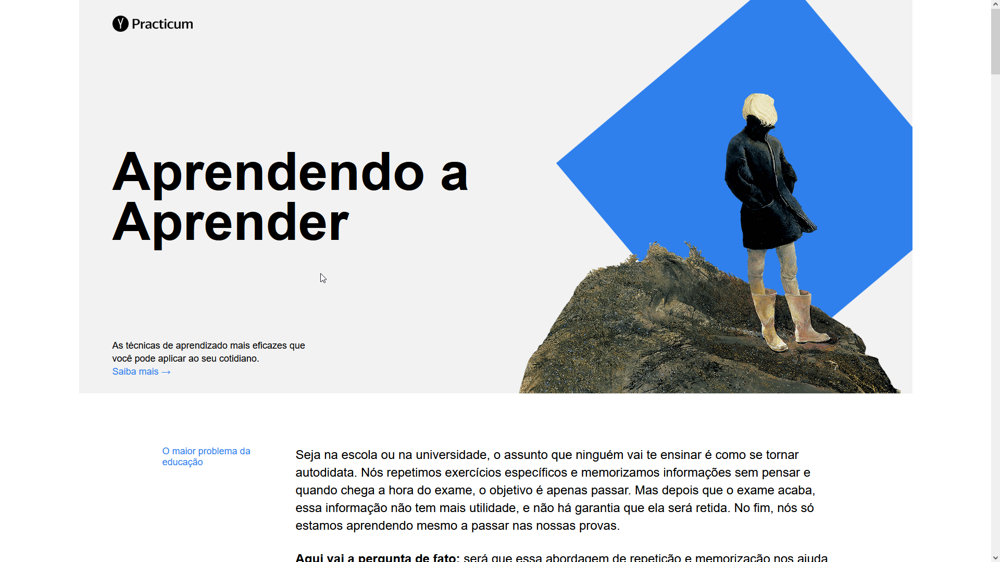

# Learning to Learn

## About

A single page application that teaches people how to learn.

It was created to practice HTML, CSS, animations and the BEM methodology, that I had been learning on TripleTen's online web development bootcamp.

This website is in brazillian portuguese!

### Click [here](https://anynoise00.github.io/learning-to-learn/) to visit the website.

## Technologies

The following tools where used for building this project:

- HTML and CSS
- BEM methodology
